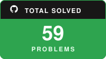

# 🎯 DSA Tracker - Apna College Sheet (375 Questions)

> Automated progress tracking for **DSA by Shradha Didi & Aman Bhaiya (Apna College)**.
> Automatically synced via **LeetSync** (`leetcode/`), **GeekSync** (`Geeks For Geeks/`), and **GitHub Actions**.

---

## 📊 Overall Progress Summary

<table>
  <thead>
    <tr>
      <th align="left">Metric</th>
      <th align="center">Solved</th>
      <th align="center">Total</th>
      <th align="left">Progress</th>
      <th align="center">🔥 Total Problems Solved</th>
    </tr>
  </thead>
  <tbody>
    <tr>
      <td><b>🎯 Apna College Sheet</b></td>
      <td align="center"><code>40</code></td>
      <td align="center"><code>375</code></td>
      <td><code>██░░░░░░░░░░░░░░░░</code> <b>10.7%</b></td>
      <td rowspan="3" align="center" valign="middle">
        
      </td>
    </tr>
    <tr>
      <td><b>🌟 Outside Sheet Problems</b></td>
      <td align="center"><code>19</code></td>
      <td align="center">-</td>
      <td><code>██████████████████</code> <b>Tracked</b></td>
    </tr>
    <tr>
      <td><b>🔥 Total Solved in Repo</b></td>
      <td align="center"><code>59</code></td>
      <td align="center">-</td>
      <td><b>All Platforms</b></td>
    </tr>
  </tbody>
</table>

---

## 📑 Topic Summary

| Topic | Solved | Total | Progress | Link |
| :--- | :---: | :---: | :--- | :---: |
| **Arrays** | `14` | `26` | `████████░░░░░░░` 53.8% | [View](#arrays) |
| **Strings** | `10` | `22` | `███████░░░░░░░░` 45.5% | [View](#strings) |
| **2D Arrays** | `3` | `10` | `████░░░░░░░░░░░` 30.0% | [View](#2d-arrays) |
| **Searching & Sorting** | `1` | `23` | `█░░░░░░░░░░░░░░` 4.3% | [View](#searching-sorting) |
| **Backtracking** | `0` | `21` | `░░░░░░░░░░░░░░░` 0.0% | [View](#backtracking) |
| **Linked List** | `8` | `26` | `█████░░░░░░░░░░` 30.8% | [View](#linked-list) |
| **Stacks & Queues** | `0` | `27` | `░░░░░░░░░░░░░░░` 0.0% | [View](#stacks-queues) |
| **Greedy** | `0` | `22` | `░░░░░░░░░░░░░░░` 0.0% | [View](#greedy) |
| **Binary Trees** | `0` | `33` | `░░░░░░░░░░░░░░░` 0.0% | [View](#binary-trees) |
| **Binary Search Trees** | `0` | `21` | `░░░░░░░░░░░░░░░` 0.0% | [View](#binary-search-trees) |
| **Heaps & Hashing** | `2` | `28` | `█░░░░░░░░░░░░░░` 7.1% | [View](#heaps-hashing) |
| **Graphs** | `0` | `40` | `░░░░░░░░░░░░░░░` 0.0% | [View](#graphs) |
| **Tries** | `0` | `6` | `░░░░░░░░░░░░░░░` 0.0% | [View](#tries) |
| **Dynamic Programming** | `1` | `54` | `░░░░░░░░░░░░░░░` 1.9% | [View](#dynamic-programming) |
| **Bit Manipulation** | `0` | `10` | `░░░░░░░░░░░░░░░` 0.0% | [View](#bit-manipulation) |
| **Segment Trees** | `1` | `6` | `██░░░░░░░░░░░░░` 16.7% | [View](#segment-trees) |

---

<h3>🌟 Outside Sheet Problems (19 Extra Solved)</h3>

> Additional 19 Problems Solved on LeetCode/GFG outside the Apna College sheet.

| # | Platform | Problem | Difficulty | Solution |
| :---: | :---: | :--- | :---: | :--- |
| 1 | **LeetCode** | [Running Sum of 1d Array](https://leetcode.com/problems/running-sum-of-1d-array/) | 🟢 Easy | [Solution](leetcode/1480-running-sum-of-1d-array) |
| 2 | **LeetCode** | [Maximum Number of Vowels in a Substring of Given Length](https://leetcode.com/problems/maximum-number-of-vowels-in-a-substring-of-given-length/) | 🟡 Medium | [Solution](leetcode/1567-maximum-number-of-vowels-in-a-substring-of-given-length) |
| 3 | **LeetCode** | [Minimum Difference Between Highest and Lowest of K Scores](https://leetcode.com/problems/minimum-difference-between-highest-and-lowest-of-k-scores/) | 🟢 Easy | [Solution](leetcode/1984-minimum-difference-between-highest-and-lowest-of-k-scores) |
| 4 | **LeetCode** | [Happy Number](https://leetcode.com/problems/happy-number/) | 🟢 Easy | [Solution](leetcode/202-happy-number) |
| 5 | **LeetCode** | [Remove Linked List Elements](https://leetcode.com/problems/remove-linked-list-elements/) | 🟢 Easy | [Solution](leetcode/203-remove-linked-list-elements) |
| 6 | **LeetCode** | [Contiguous Array](https://leetcode.com/problems/contiguous-array/) | 🟡 Medium | [Solution](leetcode/525-contiguous-array) |
| 7 | **LeetCode** | [Subarray Sum Equals K](https://leetcode.com/problems/subarray-sum-equals-k/) | 🟡 Medium | [Solution](leetcode/560-subarray-sum-equals-k) |
| 8 | **LeetCode** | [Zigzag Conversion](https://leetcode.com/problems/zigzag-conversion/) | 🟡 Medium | [Solution](leetcode/6-zigzag-conversion) |
| 9 | **LeetCode** | [Maximum Average Subarray I](https://leetcode.com/problems/maximum-average-subarray-i/) | 🟢 Easy | [Solution](leetcode/643-maximum-average-subarray-i) |
| 10 | **LeetCode** | [Set Mismatch](https://leetcode.com/problems/set-mismatch/) | 🟢 Easy | [Solution](leetcode/645-set-mismatch) |
| 11 | **LeetCode** | [Design Linked List](https://leetcode.com/problems/design-linked-list/) | 🟡 Medium | [Solution](leetcode/707-design-linked-list) |
| 12 | **LeetCode** | [Find Pivot Index](https://leetcode.com/problems/find-pivot-index/) | 🟢 Easy | [Solution](leetcode/724-find-pivot-index) |
| 13 | **LeetCode** | [Daily Temperatures](https://leetcode.com/problems/daily-temperatures/) | 🟡 Medium | [Solution](leetcode/739-daily-temperatures) |
| 14 | **LeetCode** | [Subsets](https://leetcode.com/problems/subsets/) | 🟡 Medium | [Solution](leetcode/78-subsets) |
| 15 | **LeetCode** | [Remove Duplicates from Sorted List](https://leetcode.com/problems/remove-duplicates-from-sorted-list/) | 🟢 Easy | [Solution](leetcode/83-remove-duplicates-from-sorted-list) |
| 16 | **LeetCode** | [Advantage Shuffle](https://leetcode.com/problems/advantage-shuffle/) | 🟡 Medium | [Solution](leetcode/901-advantage-shuffle) |
| 17 | **LeetCode** | [Middle of the Linked List](https://leetcode.com/problems/middle-of-the-linked-list/) | 🟢 Easy | [Solution](leetcode/908-middle-of-the-linked-list) |
| 18 | **LeetCode** | [Sort an Array](https://leetcode.com/problems/sort-an-array/) | 🟡 Medium | [Solution](leetcode/912-sort-an-array) |
| 19 | **GFG** | [Rotate Array by One](https://www.geeksforgeeks.org/problems/cyclically-rotate-an-array-by-one2614/1) | 🟢 Easy | [Solution](Geeks%20For%20Geeks/Rotate%20Array%20by%20One) |

[⬆ Back to Summary](#-topic-summary)

---

## 📚 Apna College Sheet Questions by Topic

<h3>📁 Arrays — 14/26 Solved (53.8%)</h3>

| Status | # | Problem | Companies | Notes / Remarks | Solution |
| :---: | :---: | :--- | :--- | :--- | :--- |
| ✅ | 1 | [Maximum and Minimum Element in an Array](https://www.geeksforgeeks.org/maximum-and-minimum-in-an-array/) | ABCO Accolite Amazon Cisco Hike Microsoft Snapdeal VMWare Google Adobe | - | [GFG](Geeks%20For%20Geeks/Min%20and%20Max%20in%20Array) |
| ✅ | 2 | [Reverse the Array](https://www.geeksforgeeks.org/write-a-program-to-reverse-an-array-or-string/) | Infosys Moonfrog Labs | - | [GFG](Geeks%20For%20Geeks/Reverse%20Array) |
| ✅ | 3 | [Maximum-Subarray](https://leetcode.com/problems/maximum-subarray/) | Microsoft + Facebook Interview Qs | use Kadane's Algorithm | [LeetCode](leetcode/53-maximum-subarray) |
| ✅ | 4 | [Contains Duplicate](https://leetcode.com/problems/contains-duplicate/) | Amazon Interview Qs | - | [LeetCode](leetcode/217-contains-duplicate) |
| ✅ | 5 | [Chocolate Distribution Problem](https://www.geeksforgeeks.org/chocolate-distribution-problem/) | Amazon Interview Qs | - | [GFG](Geeks%20For%20Geeks/Chocolate%20Distribution%20Problem) |
| ✅ | 6 | [Search in Rotated Sorted Array](https://leetcode.com/problems/search-in-rotated-sorted-array/) | Microsoft Google Adobe Amazon D-E-Shaw Flipkart Hike Intuit MakeMyTrip Paytm | - | [LeetCode](leetcode/33-search-in-rotated-sorted-array) |
| ✅ | 7 | [Next Permutation](https://leetcode.com/problems/next-permutation/) | Uber + Goldman Sachs + Adobe Interview Qs | - | [LeetCode](leetcode/31-next-permutation) |
| ✅ | 8 | [Best time to Buy and Sell Stock](https://leetcode.com/problems/best-time-to-buy-and-sell-stock/) | Amazon D-E-Shaw Directi Flipkart Goldman Sachs Intuit MakeMyTrip Microsoft Ola Cabs Oracle Paytm Pubmatic Quikr Salesforce Sapient Swiggy Walmart Media.net Google | - | [LeetCode](leetcode/121-best-time-to-buy-and-sell-stock) |
| ✅ | 9 | [Repeat and Missing Number Array](https://www.interviewbit.com/problems/repeat-and-missing-number-array/) | Amazon Interview Qs | - | [InterviewBit](InterviewBit/Repeat%20and%20Missing%20Number%20Array) |
| ✅ | 10 | [Kth-Largest Element in an Array](https://leetcode.com/problems/kth-largest-element-in-an-array/) | Amazon Microsoft Walmart Adobe | - | [LeetCode](leetcode/215-kth-largest-element-in-an-array) |
| ✅ | 11 | [Trapping Rain Water](https://leetcode.com/problems/trapping-rain-water/) | Samsung Interview Qs | - | [LeetCode](leetcode/42-trapping-rain-water) |
| ✅ | 12 | [Product of Array Except Self](https://leetcode.com/problems/product-of-array-except-self/) | Microsoft + Facebook Interview Qs | - | [LeetCode](leetcode/238-product-of-array-except-self) |
| ✅ | 13 | [Maximum Product Subarray](https://leetcode.com/problems/maximum-product-subarray/) | Amazon D-E-Shaw Microsoft Morgan Stanley OYO Rooms Google | - | [LeetCode](leetcode/152-maximum-product-subarray) |
| ⬜ | 14 | [Find Minimum in Rotated Sorted Array](https://leetcode.com/problems/find-minimum-in-rotated-sorted-array/) | Adobe Amazon Microsoft Morgan Stanley Samsung Snapdeal Times Internet | - | - |
| ⬜ | 15 | [Find Pair with Sum in Sorted & Rotated Array](https://www.geeksforgeeks.org/given-a-sorted-and-rotated-array-find-if-there-is-a-pair-with-a-given-sum/?ref=lbp) | Microsoft + Google + Apple Interview Qs | - | - |
| ⬜ | 16 | [3Sum](https://leetcode.com/problems/3sum/) | Adobe Amazon Microsoft Morgan Stanley Samsung Snapdeal Times Internet | - | - |
| ⬜ | 17 | [Container With Most Water](https://leetcode.com/problems/container-with-most-water/) | Flipkart + Dunzo Interview Qs | - | - |
| ✅ | 18 | [Given Sum Pair](https://www.geeksforgeeks.org/given-a-sorted-and-rotated-array-find-if-there-is-a-pair-with-a-given-sum/) | Infosys + Amazon + Flipkart Interview Qs | - | [LeetCode](leetcode/1-two-sum) |
| ⬜ | 19 | [Kth - Smallest Element](https://practice.geeksforgeeks.org/problems/kth-smallest-element5635/1) | ABCO Accolite Amazon Cisco Hike Microsoft Snapdeal VMWare Google Adobe | - | - |
| ⬜ | 20 | [Merge Overlapping Intervals](https://www.geeksforgeeks.org/merging-intervals/) | Google Interview Qs | - | - |
| ⬜ | 21 | [Find Minimum Number of Merge Operations to Make an Array Palindrome](https://www.geeksforgeeks.org/find-minimum-number-of-merge-operations-to-make-an-array-palindrome/) | Amazon | - | - |
| ⬜ | 22 | [Given an Array of Numbers Arrange the Numbers to Form the Biggest Number](https://www.geeksforgeeks.org/given-an-array-of-numbers-arrange-the-numbers-to-form-the-biggest-number/) | Barclays Interview Qs | - | - |
| ⬜ | 23 | [Space Optimization Using Bit Manipulations](https://www.geeksforgeeks.org/space-optimization-using-bit-manipulations/) | Amazon | - | - |
| ⬜ | 24 | [Subarray Sum Divisible K](https://www.geeksforgeeks.org/longest-subarray-sum-divisible-k/) | Snapdeal Microsoft | - | - |
| ⬜ | 25 | [Print all Possible Combinations of r Elements in a Given Array of Size n](https://www.geeksforgeeks.org/print-all-possible-combinations-of-r-elements-in-a-given-array-of-size-n/) | Amazon | - | - |
| ⬜ | 26 | [Mo's Algorithm](https://www.geeksforgeeks.org/mos-algorithm-query-square-root-decomposition-set-1-introduction/) | Microsoft | - | - |

[⬆ Back to Summary](#-topic-summary)

<h3>📁 Strings — 10/22 Solved (45.5%)</h3>

| Status | # | Problem | Companies | Notes / Remarks | Solution |
| :---: | :---: | :--- | :--- | :--- | :--- |
| ✅ | 27 | [Valid Palindrome](https://leetcode.com/problems/valid-palindrome/) | Amazon Cisco D-E-Shaw Facebook FactSet Morgan Stanley Paytm Zoho | - | [LeetCode](leetcode/125-valid-palindrome) |
| ✅ | 28 | [Valid Anagram](https://leetcode.com/problems/valid-anagram/) | Nagarro Media.net Directi Google Adobe Flipkart | - | [LeetCode](leetcode/242-valid-anagram) |
| ✅ | 29 | [Valid parentheses](https://leetcode.com/problems/valid-parentheses/) | Google Interview Qs | use Stacks (if possible) | [LeetCode](leetcode/20-valid-parentheses) |
| ⬜ | 30 | [Remove Consecutive Characters](https://practice.geeksforgeeks.org/problems/consecutive-elements2306/1) | Samsung + Adobe | - | - |
| ✅ | 31 | [Longest Common Prefix](https://leetcode.com/problems/longest-common-prefix/) | Adobe + Grofers + Dunzo Interview Qs | - | [LeetCode](leetcode/14-longest-common-prefix) |
| ⬜ | 32 | [Convert a Sentence into its Equivalent Mobile Numeric Keypad Sequence](https://www.geeksforgeeks.org/convert-sentence-equivalent-mobile-numeric-keypad-sequence/) | Adobe | - | - |
| ⬜ | 33 | [Print all the Duplicates in the Input String](https://www.geeksforgeeks.org/print-all-the-duplicates-in-the-input-string/) | Ola + Amdocs IQ | - | - |
| ✅ | 34 | [Longest Substring without Repeating Characters](https://leetcode.com/problems/longest-substring-without-repeating-characters/) | Morgan Stanley + Amazon IQ | - | [LeetCode](leetcode/3-longest-substring-without-repeating-characters) |
| ✅ | 35 | [Longest Repeating Character Replacement](https://leetcode.com/problems/longest-repeating-character-replacement/) | Amazon Google | - | [LeetCode](leetcode/424-longest-repeating-character-replacement) |
| ✅ | 36 | [Group Anagrams](https://leetcode.com/problems/group-anagrams/) | Samsung + Adobe + Amazon Interview Qs | - | [LeetCode](leetcode/49-group-anagrams) |
| ✅ | 37 | [Longest Palindromic Substring](https://leetcode.com/problems/longest-palindromic-substring/) | Microsoft + Google + Samsung + Visa IQ | - | [LeetCode](leetcode/5-longest-palindromic-substring) |
| ✅ | 38 | [Palindromic Substrings](https://leetcode.com/problems/palindromic-substrings/) | Microsoft IQ | - | [LeetCode](leetcode/647-palindromic-substrings) |
| ✅ | 39 | [Next Permutation](https://practice.geeksforgeeks.org/problems/next-permutation5226/1) | Adobe + Goldman Sachs + Uber | - | [LeetCode](leetcode/31-next-permutation) |
| ⬜ | 40 | [Count Palindromic Subsequences](https://practice.geeksforgeeks.org/problems/count-palindromic-subsequences/1) | Myntra Interview Qs | - | - |
| ⬜ | 41 | [Smallest Window in a String Containing all the Characters of Another String](https://practice.geeksforgeeks.org/problems/smallest-window-in-a-string-containing-all-the-characters-of-another-string-1587115621/1) | Microsoft + Amazon IQ | - | - |
| ⬜ | 42 | [Wildcard String Matching](https://practice.geeksforgeeks.org/problems/wildcard-string-matching1126/1) | Microsoft + Amazon + Ola IQ | - | - |
| ⬜ | 43 | [Longest Prefix Suffix](https://practice.geeksforgeeks.org/problems/longest-prefix-suffix2527/1) | Flipkart + Swiggy IQ | - | - |
| ⬜ | 44 | [Rabin-Karp Algorithm for Pattern Searching](https://www.geeksforgeeks.org/rabin-karp-algorithm-for-pattern-searching/) | Microsoft | - | - |
| ⬜ | 45 | [Transform One String to Another using Minimum Number of Given Operation](https://www.geeksforgeeks.org/transform-one-string-to-another-using-minimum-number-of-given-operation/) | Directi | - | - |
| ⬜ | 46 | [Minimum Window Substring](https://leetcode.com/problems/minimum-window-substring/) | Amazon Google MakeMyTrip Streamoid Technologies Microsoft Media.net Atlassian Flipkart | - | - |
| ⬜ | 47 | [Boyer Moore Algorithm for Pattern Searching](https://www.geeksforgeeks.org/boyer-moore-algorithm-for-pattern-searching/) | Amdocs | - | - |
| ⬜ | 48 | [Word Wrap](https://practice.geeksforgeeks.org/problems/word-wrap1646/1) | Microsoft | use Dynaming Programming | - |

[⬆ Back to Summary](#-topic-summary)

<h3>📁 2D Arrays — 3/10 Solved (30.0%)</h3>

| Status | # | Problem | Companies | Notes / Remarks | Solution |
| :---: | :---: | :--- | :--- | :--- | :--- |
| ✅ | 49 | [Zigzag (or diagonal) Traversal of Matrix](https://www.geeksforgeeks.org/zigzag-or-diagonal-traversal-of-matrix/) | Amazon | - | [LeetCode](leetcode/498-diagonal-traverse) |
| ✅ | 50 | [Set Matrix Zeroes](https://leetcode.com/problems/set-matrix-zeroes/) | Amazon Microsoft | - | [LeetCode](leetcode/73-set-matrix-zeroes) |
| ✅ | 51 | [Spiral Matrix](https://leetcode.com/problems/spiral-matrix/) | Flipkart + Apple + Societe Generale IQ | - | [LeetCode](leetcode/54-spiral-matrix) |
| ⬜ | 52 | [Rotate Image](https://leetcode.com/problems/rotate-image/) | Microsoft Paytm Samsung Adobe | - | - |
| ⬜ | 53 | [Word Search](https://leetcode.com/problems/word-search/) | Google + Ola + Goldman Sachs IQ | - | - |
| ⬜ | 54 | [Find the Number of Islands | Set 1 (Using DFS)](https://www.geeksforgeeks.org/find-number-of-islands/) | Microsoft + Uber + Apple + Amazon IQ | Read about DFS | - |
| ⬜ | 55 | [Given a Matrix of ‘O’ and ‘X’, Replace ‘O’ with ‘X’ if Surrounded by ‘X’](https://www.geeksforgeeks.org/given-matrix-o-x-replace-o-x-surrounded-x/) | Google | - | - |
| ⬜ | 56 | [Find a Common Element in all Rows of a Given Row-Wise Sorted Matrix](https://www.geeksforgeeks.org/find-common-element-rows-row-wise-sorted-matrix/) | MAQ Software Microsoft VMWare | - | - |
| ⬜ | 57 | [Create a Matrix with Alternating Rectangles of O and X](https://www.geeksforgeeks.org/create-a-matrix-with-alternating-rectangles-of-0-and-x/) | MAQ VMWare | - | - |
| ⬜ | 58 | [Maximum Size Rectangle of all 1s](https://www.geeksforgeeks.org/maximum-size-rectangle-binary-sub-matrix-1s/) | Amazon Microsoft | - | - |

[⬆ Back to Summary](#-topic-summary)

<h3>📁 Searching & Sorting — 1/23 Solved (4.3%)</h3>

| Status | # | Problem | Companies | Notes / Remarks | Solution |
| :---: | :---: | :--- | :--- | :--- | :--- |
| ⬜ | 59 | [Permute Two Arrays such that Sum of Every Pair is Greater or Equal to K](https://www.geeksforgeeks.org/permute-two-arrays-sum-every-pair-greater-equal-k/) | Samsung | - | - |
| ⬜ | 60 | [counting sort](https://www.geeksforgeeks.org/counting-sort/) | Samsung+ Morgan Stanley+ Snapdeal + EPAM Systems | - | - |
| ⬜ | 61 | [find common elements three sorted arrays](https://www.geeksforgeeks.org/find-common-elements-three-sorted-arrays/) | MAQ Software Microsoft VMWare | - | - |
| ⬜ | 62 | [Searching in an array where adjacent differ by at most k](https://www.geeksforgeeks.org/searching-array-adjacent-differ-k/) | TCS Amazon | - | - |
| ⬜ | 63 | [ceiling in a sorted array](https://www.geeksforgeeks.org/ceiling-in-a-sorted-array/) | TCS | - | - |
| ⬜ | 64 | [Piar with given difference](https://www.geeksforgeeks.org/find-a-pair-with-the-given-difference/) | Amazon Visa | - | - |
| ⬜ | 65 | [majority element](https://www.geeksforgeeks.org/majority-element/) | Amazon+ Google | - | - |
| ⬜ | 66 | [count triplets with sum smaller that a given value](https://www.geeksforgeeks.org/count-triplets-with-sum-smaller-that-a-given-value/) | Amazon SAP Labs | - | - |
| ⬜ | 67 | [Maximum Sum Subsequence with no adjacent elements](https://www.geeksforgeeks.org/maximum-sum-such-that-no-two-elements-are-adjacent/) | Amazon FactSet Oxigen Wallet OYO Rooms Paytm Walmart Yahoo Adobe Flipkart | - | - |
| ⬜ | 68 | [Merge Sorted Arrays using O(1) Space](https://www.geeksforgeeks.org/merge-two-sorted-arrays-o1-extra-space/) | Amdocs Brocade Goldman Sachs Juniper Networks Linkedin Microsoft Quikr Snapdeal Synopsys Zoho Adobe | - | - |
| ⬜ | 69 | [Inversion of Array](https://practice.geeksforgeeks.org/problems/inversion-of-array-1587115620/1) | Adobe Amazon BankBazaar Flipkart Microsoft Myntra MakeMyTrip | - | - |
| ⬜ | 70 | [Find Duplicates in O(n) Time and O(1) Extra Space](https://www.geeksforgeeks.org/find-duplicates-in-on-time-and-constant-extra-space/) | Amazon D-E-Shaw Flipkart Paytm Qualcomm Zoho | - | - |
| ⬜ | 71 | [Radix Sort](https://www.geeksforgeeks.org/radix-sort/) | Amazon+ Microsoft | - | - |
| ⬜ | 72 | [Product of Array except itself](https://www.geeksforgeeks.org/a-product-array-puzzle/) | Accolite Amazon D-E-Shaw Intuit Morgan Stanley Opera Microsoft Flipkart | - | - |
| ⬜ | 73 | [Make all Array Elements Equal](https://www.geeksforgeeks.org/make-array-elements-equal-minimum-cost/) | Amazon | - | - |
| ⬜ | 74 | [Check if Reversing a Sub Array Make the Array Sorted](https://www.geeksforgeeks.org/check-reversing-sub-array-make-array-sorted/) | Amazon | - | - |
| ⬜ | 75 | [Find Four Elements that Sum to a Given Value](https://www.geeksforgeeks.org/find-four-elements-that-sum-to-a-given-value-set-2/) | Adobe Amazon Google Microsoft OYO Rooms | - | - |
| ✅ | 76 | [Median of Two Sorted Array with Different Size](https://www.geeksforgeeks.org/median-of-two-sorted-arrays-of-different-sizes/) | Amazon Samsung Microsoft Google | - | [LeetCode](leetcode/4-median-of-two-sorted-arrays) |
| ⬜ | 77 | [Median of Stream of Integers Running Integers](https://www.geeksforgeeks.org/median-of-stream-of-integers-running-integers/) | Amazon + Google | - | - |
| ⬜ | 78 | [Print Subarrays with 0 Sum](https://www.geeksforgeeks.org/print-all-subarrays-with-0-sum/) | Paytm Adobe | - | - |
| ⬜ | 79 | [Aggressive Cows](https://www.spoj.com/problems/AGGRCOW/) | Adobe | - | - |
| ⬜ | 80 | [Allocate Minimum number of Pages](https://practice.geeksforgeeks.org/problems/allocate-minimum-number-of-pages0937/1) | Google Infosys Codenation Amazon Microsoft | - | - |
| ⬜ | 81 | [Minimum Swaps to Sort](https://www.geeksforgeeks.org/minimum-number-swaps-required-sort-array/) | Amazon + Google | - | - |

[⬆ Back to Summary](#-topic-summary)

<h3>📁 Backtracking — 0/21 Solved (0.0%)</h3>

| Status | # | Problem | Companies | Notes / Remarks | Solution |
| :---: | :---: | :--- | :--- | :--- | :--- |
| ⬜ | 82 | [Backtracking Set 2 Rat in a Maze](https://www.geeksforgeeks.org/backttracking-set-2-rat-in-a-maze/) | Microsoft Amazon | - | - |
| ⬜ | 83 | [Combinational Sum](https://www.geeksforgeeks.org/combinational-sum/) | Adobe Amazon Microsoft | - | - |
| ⬜ | 84 | [Crossword-Puzzle](https://www.hackerrank.com/challenges/crossword-puzzle/problem) | Microsoft | - | - |
| ⬜ | 85 | [Longest Possible Route in a Matrix with Hurdles](https://www.geeksforgeeks.org/longest-possible-route-in-a-matrix-with-hurdles/) | Microsoft | - | - |
| ⬜ | 86 | [Printing all solutions in N-Queen Problem](https://www.geeksforgeeks.org/printing-solutions-n-queen-problem/) | Accolite Amazon Amdocs D-E-Shaw MAQ Software Twitter Visa Microsoft | - | - |
| ⬜ | 87 | [Solve the Sudoku](https://practice.geeksforgeeks.org/problems/solve-the-sudoku-1587115621/1) | Amazon Directi Flipkart MakeMyTrip MAQ Software Microsoft Ola Cabs Oracle PayPal Zoho | - | - |
| ⬜ | 88 | [Partition Equal Subset Sum](https://practice.geeksforgeeks.org/problems/subset-sum-problem2014/1) | Amazon + Adobe + Accolite + Traveloka | - | - |
| ⬜ | 89 | [M Coloring Problem](https://practice.geeksforgeeks.org/problems/m-coloring-problem-1587115620/1) | Amazon | - | - |
| ⬜ | 90 | [Knight Tour](https://www.geeksforgeeks.org/backtracking-set-1-the-knights-tour-problem/) | IBM | - | - |
| ⬜ | 91 | [Soduko](https://www.geeksforgeeks.org/backtracking-set-7-suduku/) | Amazon + Adobe + Accolite + Traveloka | - | - |
| ⬜ | 92 | [Remove Invalid Parentheses](https://www.geeksforgeeks.org/remove-invalid-parentheses/) | Uber | - | - |
| ⬜ | 93 | [Word Break Problem using Backtracking](https://www.geeksforgeeks.org/word-break-problem-using-backtracking/) | - | - | - |
| ⬜ | 94 | [Print all Palindromic Partitions of a String](https://www.geeksforgeeks.org/print-palindromic-partitions-string/) | Facebook Amazon Microsoft | - | - |
| ⬜ | 95 | [Find Shortest Safe Route in a Path with Landmines](https://www.geeksforgeeks.org/find-shortest-safe-route-in-a-path-with-landmines/) | Facebook Amazon Microsoft | - | - |
| ⬜ | 96 | [Partition of Set into K Subsets with Equal Sum](https://www.geeksforgeeks.org/partition-set-k-subsets-equal-sum/) | Amazon | - | - |
| ⬜ | 97 | [Backtracking set-7 hamiltonian cycle](https://www.geeksforgeeks.org/backtracking-set-7-hamiltonian-cycle/) | Amazon | - | - |
| ⬜ | 98 | [tug-of-war](https://www.geeksforgeeks.org/tug-of-war/) | Google | - | - |
| ⬜ | 99 | [Maximum Possible Number by doing at most K swaps](https://www.geeksforgeeks.org/find-maximum-number-possible-by-doing-at-most-k-swaps/) | Amazon + Adobe + Accolite + Traveloka | - | - |
| ⬜ | 100 | [Backtracking set-8 solving cryptarithmetic puzzles](https://www.geeksforgeeks.org/backtracking-set-8-solving-cryptarithmetic-puzzles/) | Goldman Sachs | - | - |
| ⬜ | 101 | [Find paths from corner cell to middle cell in maze](https://www.geeksforgeeks.org/find-paths-from-corner-cell-to-middle-cell-in-maze/) | Meta | - | - |
| ⬜ | 102 | [Arithmetic Expressions](https://www.hackerrank.com/challenges/arithmetic-expressions/problem) | Flipkart | - | - |

[⬆ Back to Summary](#-topic-summary)

<h3>📁 Linked List — 8/26 Solved (30.8%)</h3>

| Status | # | Problem | Companies | Notes / Remarks | Solution |
| :---: | :---: | :--- | :--- | :--- | :--- |
| ✅ | 103 | [Reverse Linked List](https://leetcode.com/problems/reverse-linked-list/) | Sprinklr | - | [LeetCode](leetcode/206-reverse-linked-list) |
| ✅ | 104 | [Linked List Cycle](https://leetcode.com/problems/linked-list-cycle/) | Accolite Amazon D-E-Shaw Hike Lybrate Mahindra Comviva MakeMyTrip MAQ Software OYO Rooms Paytm Qualcomm Samsung SAP Labs Snapdeal Veritas VMWare Walmart Adobe | - | [LeetCode](leetcode/141-linked-list-cycle) |
| ⬜ | 105 | [Merge Two Sorted Lists](https://leetcode.com/problems/merge-two-sorted-lists/) | Accolite Amazon Belzabar Brocade FactSet Flipkart MakeMyTrip Microsoft OATS Systems Oracle Samsung Synopsys Zoho | - | - |
| ✅ | 106 | [Delete without Head node](https://www.geeksforgeeks.org/given-only-a-pointer-to-a-node-to-be-deleted-in-a-singly-linked-list-how-do-you-delete-it/) | Amazon Goldman Sachs Kritikal Solutions Microsoft Samsung Visa | - | [LeetCode](leetcode/237-delete-node-in-a-linked-list) \| [GFG](Geeks%20For%20Geeks/Delete%20Node%20Without%20Linked%20List%20Head) |
| ✅ | 107 | [Remove duplicates from an unsorted linked list](https://www.geeksforgeeks.org/remove-duplicates-from-an-unsorted-linked-list/) | Amazon Intuit | - | [GFG](Geeks%20For%20Geeks/Remove%20Duplicates%20from%20Linked%20List) |
| ⬜ | 108 | [Sort a linked list of 0s-1s-or-2s](https://www.geeksforgeeks.org/sort-a-linked-list-of-0s-1s-or-2s/) | Microsoft Amazon MakeMyTrip | - | - |
| ✅ | 109 | [Multiply two numbers represented linked lists](https://www.geeksforgeeks.org/multiply-two-numbers-represented-linked-lists/) | Amazon | - | [GFG](Geeks%20For%20Geeks/Multiply%20Two%20Linked%20Lists) |
| ✅ | 110 | [Remove nth node from end of list](https://leetcode.com/problems/remove-nth-node-from-end-of-list/) | Accolite Adobe Amazon Citicorp Epic Systems FactSet Hike MAQ Software Monotype Solutions Morgan Stanley OYO Rooms Qualcomm Samsung Snapdeal Flipkart | - | [LeetCode](leetcode/19-remove-nth-node-from-end-of-list) |
| ⬜ | 111 | [Reorder List](https://leetcode.com/problems/reorder-list/) | Amazon Microsoft OYO Rooms Intuit | - | - |
| ✅ | 112 | [Detect and remove loop in a linked list](https://www.geeksforgeeks.org/detect-and-remove-loop-in-a-linked-list/) | Accolite Amazon D-E-Shaw Hike Lybrate Mahindra Comviva MakeMyTrip MAQ Software OYO Rooms Paytm Qualcomm Samsung SAP Labs Snapdeal Veritas VMWare Walmart Adobe | - | [LeetCode](leetcode/142-linked-list-cycle-ii) |
| ⬜ | 113 | [Write a Function to get the Intersection Point of two Linked Lists](https://www.geeksforgeeks.org/write-a-function-to-get-the-intersection-point-of-two-linked-lists/) | Amazon | - | - |
| ⬜ | 114 | [Flatten a linked list with next and child pointers](https://www.geeksforgeeks.org/flatten-a-linked-list-with-next-and-child-pointers/) | Google | - | - |
| ⬜ | 115 | [Linked list in zig-zag fashion](https://www.geeksforgeeks.org/linked-list-in-zig-zag-fashion/) | Micorsoft | - | - |
| ⬜ | 116 | [Reverse a doubly linked list](https://practice.geeksforgeeks.org/problems/reverse-a-doubly-linked-list/1) | Walmart | - | - |
| ⬜ | 117 | [Delete nodes which have a greater value on right side](https://www.geeksforgeeks.org/delete-nodes-which-have-a-greater-value-on-right-side/) | Amazon | - | - |
| ⬜ | 118 | [Segregate even and odd Elements in a Linked List](https://www.geeksforgeeks.org/segregate-even-and-odd-elements-in-a-linked-list/) | Walmart | - | - |
| ⬜ | 119 | [Point to next higher value node in a linked list with an Arbitrary Pointer](https://www.geeksforgeeks.org/point-to-next-higher-value-node-in-a-linked-list-with-an-arbitrary-pointer/) | GeekyAnts | - | - |
| ⬜ | 120 | [Rearrange a given linked list in place](https://www.geeksforgeeks.org/rearrange-a-given-linked-list-in-place/) | Ola Uber | - | - |
| ⬜ | 121 | [Sort Biotonic Doubly Linked Lists](https://www.geeksforgeeks.org/sort-biotonic-doubly-linked-list/) | Morgan Stanley | - | - |
| ⬜ | 122 | [Merge K Sorted Lists](https://leetcode.com/problems/merge-k-sorted-lists/) | Microsoft+ Ola+ eBay | - | - |
| ⬜ | 123 | [Merge sort for linked list](https://www.geeksforgeeks.org/merge-sort-for-linked-list/) | Accolite Adobe Amazon MAQ Software Microsoft Paytm Veritas | Important | - |
| ⬜ | 124 | [Quicksort on singly-linked list](https://www.geeksforgeeks.org/quicksort-on-singly-linked-list/) | Paytm | Important | - |
| ✅ | 125 | [Sum of two linked lists](https://www.geeksforgeeks.org/sum-of-two-linked-lists/) | Accolite Amazon Flipkart MakeMyTrip Microsoft Morgan Stanley Qualcomm Snapdeal | - | [LeetCode](leetcode/2-add-two-numbers) |
| ⬜ | 126 | [Flattening a linked list](https://www.geeksforgeeks.org/flattening-a-linked-list/) | 24*7 Innovation Labs Amazon Drishti-Soft Flipkart Goldman Sachs Microsoft Paytm Payu Qualcomm Snapdeal Visa | - | - |
| ⬜ | 127 | [Clone a linked list with next and random Pointer](https://www.geeksforgeeks.org/a-linked-list-with-next-and-arbit-pointer/) | Triology | - | - |
| ⬜ | 128 | [Subtract two numbers represented as linked lists](https://www.geeksforgeeks.org/subtract-two-numbers-represented-as-linked-lists/) | Amazon Goldman Sachs | - | - |

[⬆ Back to Summary](#-topic-summary)

<h3>📁 Stacks & Queues — 0/27 Solved (0.0%)</h3>

| Status | # | Problem | Companies | Notes / Remarks | Solution |
| :---: | :---: | :--- | :--- | :--- | :--- |
| ⬜ | 129 | [Implement two stacks in an Array](https://www.geeksforgeeks.org/implement-two-stacks-in-an-array/) | 24*7 Innovation Labs Microsoft Samsung Snapdeal | - | - |
| ⬜ | 130 | [Evaluation of Postfix Expression](https://www.geeksforgeeks.org/stack-set-4-evaluation-postfix-expression/) | Amazon + Google + Facebook | - | - |
| ⬜ | 131 | [Implement Stack using Queues](https://leetcode.com/problems/implement-stack-using-queues/) | Facebook | - | - |
| ⬜ | 132 | [Queue Reversal](https://practice.geeksforgeeks.org/problems/queue-reversal/1) | Amazon + Morgain Stanley | - | - |
| ⬜ | 133 | [Implement Stack Queue using Deque](https://www.geeksforgeeks.org/implement-stack-queue-using-deque/) | Microsoft +Atlassian | - | - |
| ⬜ | 134 | [Reverse first k elements of queue](https://practice.geeksforgeeks.org/problems/reverse-first-k-elements-of-queue/1) | Microsoft + Amdocs | - | - |
| ⬜ | 135 | [Design Stack with Middle Operation](https://www.geeksforgeeks.org/design-a-stack-with-find-middle-operation/) | MaQ Software | - | - |
| ⬜ | 136 | [Infix to Postfix](https://www.geeksforgeeks.org/stack-set-2-infix-to-postfix/) | Amazon + Samsung + Paytm + Vmware inc | - | - |
| ⬜ | 137 | [Design and Implement Special stack](https://www.geeksforgeeks.org/design-and-implement-special-stack-data-structure/) | Amazon Google Microsoft Visa Goldman Sachs | - | - |
| ⬜ | 138 | [Longest Valid String](https://www.geeksforgeeks.org/length-of-the-longest-valid-substring/) | Google Microsoft | - | - |
| ⬜ | 139 | [Find if an expression has duplicate parenthesis or not](https://www.geeksforgeeks.org/find-expression-duplicate-parenthesis-not/) | Flipkart Oracle OYO Rooms Snapdeal Walmart Yatra.com Microsoft Google | - | - |
| ⬜ | 140 | [Stack permutations check if an array is stack permutation of other](https://www.geeksforgeeks.org/stack-permutations-check-if-an-array-is-stack-permutation-of-other/) | Visa | - | - |
| ⬜ | 141 | [Count natural numbers whose permutation greater number](https://www.geeksforgeeks.org/count-natural-numbers-whose-permutation-greater-number/) | Amazon | - | - |
| ⬜ | 142 | [Sort a stack using Recursion](https://www.geeksforgeeks.org/sort-a-stack-using-recursion/) | Amazon Goldman Sachs IBM Intuit Kuliza Yahoo Microsoft | - | - |
| ⬜ | 143 | [Queue based approach for first non repeating character in a stream](https://www.geeksforgeeks.org/queue-based-approach-for-first-non-repeating-character-in-a-stream/) | Microsoft Flipkart | - | - |
| ⬜ | 144 | [The Celebrity Problem](https://practice.geeksforgeeks.org/problems/the-celebrity-problem/1) | Google + Visa + Apple | - | - |
| ⬜ | 145 | [Next larger Element](https://practice.geeksforgeeks.org/problems/next-larger-element-1587115620/1) | Visa | - | - |
| ⬜ | 146 | [Distance of nearest cell](https://practice.geeksforgeeks.org/problems/distance-of-nearest-cell-having-1-1587115620/1) | Flipkar + Facebook | - | - |
| ⬜ | 147 | [Rotten-oranges](https://practice.geeksforgeeks.org/problems/rotten-oranges2536/1) | Facebook | - | - |
| ⬜ | 148 | [Next smaller element](https://www.geeksforgeeks.org/next-smaller-element/) | Codenation | - | - |
| ⬜ | 149 | [Circular-tour](https://practice.geeksforgeeks.org/problems/circular-tour/1) | Codenation Flipkart | - | - |
| ⬜ | 150 | [Efficiently implement k-stacks single array](https://www.geeksforgeeks.org/efficiently-implement-k-stacks-single-array/) | Flipkart | - | - |
| ⬜ | 151 | [The celebrity problem](http://geeksforgeeks.org/the-celebrity-problem/) | Google + Visa + Apple | - | - |
| ⬜ | 152 | [Iterative tower of hanoi](https://www.geeksforgeeks.org/iterative-tower-of-hanoi/) | Microsoft Flipkart | - | - |
| ⬜ | 153 | [Find the maximum of minimums for every window size in a given array](https://www.geeksforgeeks.org/find-the-maximum-of-minimums-for-every-window-size-in-a-given-array/) | Amazon Microsoft Flipkart | - | - |
| ⬜ | 154 | [lru cache implementation](https://www.geeksforgeeks.org/lru-cache-implementation/) | Microsoft + Uber + Alibaba | - | - |
| ⬜ | 155 | [Find a tour that visits all stations](https://www.geeksforgeeks.org/find-a-tour-that-visits-all-stations/) | Uber | - | - |

[⬆ Back to Summary](#-topic-summary)

<h3>📁 Greedy — 0/22 Solved (0.0%)</h3>

| Status | # | Problem | Companies | Notes / Remarks | Solution |
| :---: | :---: | :--- | :--- | :--- | :--- |
| ⬜ | 156 | [Activity selection problem greedy algo](https://www.geeksforgeeks.org/activity-selection-problem-greedy-algo-1/) | Facebook Morgan Stanley Flipkart | - | - |
| ⬜ | 157 | [Greedy algorithm to find minimum number of coins](https://www.geeksforgeeks.org/greedy-algorithm-to-find-minimum-number-of-coins/) | Accolite Amazon Morgan Stanley Oracle Paytm Samsung Snapdeal Synopsys Visa Microsoft Google | - | - |
| ⬜ | 158 | [Minimum sum two numbers formed digits array-2](https://www.geeksforgeeks.org/minimum-sum-two-numbers-formed-digits-array-2/) | Google | - | - |
| ⬜ | 159 | [Minimum sum absolute difference pairs two arrays](https://www.geeksforgeeks.org/minimum-sum-absolute-difference-pairs-two-arrays/) | Amazon | - | - |
| ⬜ | 160 | [Find maximum height pyramid from the given array of objects](https://www.geeksforgeeks.org/find-maximum-height-pyramid-from-the-given-array-of-objects/) | Flipkart Amazon | - | - |
| ⬜ | 161 | [Minimum cost for acquiring all coins with k extra coins allowed with every coin](https://www.geeksforgeeks.org/minimum-cost-for-acquiring-all-coins-with-k-extra-coins-allowed-with-every-coin/) | - | - | - |
| ⬜ | 162 | [Find maximum equal sum of every three stacks](http://geeksforgeeks.org/find-maximum-sum-possible-equal-sum-three-stacks/) | Microsoft  Amazon Flipkart | - | - |
| ⬜ | 163 | [Job sequencing problem](https://www.geeksforgeeks.org/job-sequencing-problem/) | Microsoft + Acolite | - | - |
| ⬜ | 164 | [Greedy algorithm egyptian fraction](https://www.geeksforgeeks.org/greedy-algorithm-egyptian-fraction/) | - | - | - |
| ⬜ | 165 | [Fractional knapsack problem](https://www.geeksforgeeks.org/fractional-knapsack-problem/) | Microsoft | - | - |
| ⬜ | 166 | [Maximum length chain of pairs](https://www.geeksforgeeks.org/maximum-length-chain-of-pairs-dp-20/) | Amazon Microsoft | - | - |
| ⬜ | 167 | [Find smallest number with given number of digits and digit sum](https://www.geeksforgeeks.org/find-smallest-number-with-given-number-of-digits-and-digit-sum/) | MAQ Software OYO Rooms | - | - |
| ⬜ | 168 | [Maximize sum of consecutive differences circular-array](https://www.geeksforgeeks.org/maximize-sum-consecutive-differences-circular-array/) | Maccafe | - | - |
| ⬜ | 169 | [paper-cut minimum number squares](https://www.geeksforgeeks.org/paper-cut-minimum-number-squares/) | Google | - | - |
| ⬜ | 170 | [Lexicographically smallest array-k consecutive swaps](http://geeksforgeeks.org/lexicographically-smallest-array-k-consecutive-swaps/) | Amazon | - | - |
| ⬜ | 171 | [Problems-CHOCOLA](https://www.spoj.com/problems/CHOCOLA/) | Flipkart | - | - |
| ⬜ | 172 | [Find minimum time to finish all jobs with given constraints](https://www.geeksforgeeks.org/find-minimum-time-to-finish-all-jobs-with-given-constraints/) | - | - | - |
| ⬜ | 173 | [Job sequencing using disjoint set union](https://www.geeksforgeeks.org/job-sequencing-using-disjoint-set-union/) | Samsung | - | - |
| ⬜ | 174 | [Rearrange characters string such that no two adjacent are same](https://www.geeksforgeeks.org/rearrange-characters-string-no-two-adjacent/) | Amazon Microsoft | - | - |
| ⬜ | 175 | [Minimum edges to reverse to make path from a source to a destination](https://www.geeksforgeeks.org/minimum-edges-reverse-make-path-source-destination/) | - | - | - |
| ⬜ | 176 | [Minimize Cash Flow among a given set of friends who have borrowed money from each other](https://www.geeksforgeeks.org/minimize-cash-flow-among-given-set-friends-borrowed-money/) | - | - | - |
| ⬜ | 177 | [Minimum Cost to cut a board into squares](https://www.geeksforgeeks.org/minimum-cost-cut-board-squares/) | Maccafe | - | - |

[⬆ Back to Summary](#-topic-summary)

<h3>📁 Binary Trees — 0/33 Solved (0.0%)</h3>

| Status | # | Problem | Companies | Notes / Remarks | Solution |
| :---: | :---: | :--- | :--- | :--- | :--- |
| ⬜ | 178 | [Maximum Depth of Binary Tree](https://leetcode.com/problems/maximum-depth-of-binary-tree/) | Amazon Cadence India CouponDunia D-E-Shaw FactSet FreeCharge MakeMyTrip | - | - |
| ⬜ | 179 | [Reverse Level Order Traversal](https://practice.geeksforgeeks.org/problems/reverse-level-order-traversal/1) | Amazon + Microsoft + flipkart + Adobe | - | - |
| ⬜ | 180 | [Subtree of Another Tree](https://leetcode.com/problems/subtree-of-another-tree/) | Amazon + Microsoft + Facebook | - | - |
| ⬜ | 181 | [Invert Binary Tree](https://leetcode.com/problems/invert-binary-tree/) | Amazon Hike | - | - |
| ⬜ | 182 | [Binary Tree Level Order Traversal](https://leetcode.com/problems/binary-tree-level-order-traversal/) | Accolite Adobe Amazon Cisco D-E-Shaw Flipkart | - | - |
| ⬜ | 183 | [Left View of Binary Tree](https://practice.geeksforgeeks.org/problems/left-view-of-binary-tree/1) | Microsoft + Adobe + Cisco Networking Academy | - | - |
| ⬜ | 184 | [Right View of Binary Tree](https://practice.geeksforgeeks.org/problems/right-view-of-binary-tree/1) | Amdocs | - | - |
| ⬜ | 185 | [ZigZag Tree Traversal](https://practice.geeksforgeeks.org/problems/zigzag-tree-traversal/1) | Amazon Cisco FactSet Hike Snapdeal Walmart Microsoft Flipkart | - | - |
| ⬜ | 186 | [Create a mirror tree from the given binary tree](https://www.geeksforgeeks.org/create-a-mirror-tree-from-the-given-binary-tree/) | Accolite Adobe Amazon Belzabar EBay Goldman Sachs Microsoft Morgan Stanley Myntra Ola Cabs Paytm | - | - |
| ⬜ | 187 | [Leaf at same level](https://practice.geeksforgeeks.org/problems/leaf-at-same-level/1) | Amazon | - | - |
| ⬜ | 188 | [Check for Balanced Tree](https://practice.geeksforgeeks.org/problems/check-for-balanced-tree/1) | Amazon Walmart Microsoft | - | - |
| ⬜ | 189 | [Transform to Sum Tree](https://practice.geeksforgeeks.org/problems/transform-to-sum-tree/1) | Amazon FactSet Microsoft Samsung Walmart | - | - |
| ⬜ | 190 | [Check if Tree is Isomorphic](https://practice.geeksforgeeks.org/problems/check-if-tree-is-isomorphic/1) | Amazon Microsoft | - | - |
| ⬜ | 191 | [Same Tree](https://leetcode.com/problems/same-tree/) | Amazon Microsoft Flipkart | - | - |
| ⬜ | 192 | [Construct Binary Tree from Preorder and Inorder Traversal](https://leetcode.com/problems/construct-binary-tree-from-preorder-and-inorder-traversal/) | Accolite Amazon Microsoft | - | - |
| ⬜ | 193 | [Height of Binary Tree](https://practice.geeksforgeeks.org/problems/height-of-binary-tree/1) | Amazon Cadence India CouponDunia D-E-Shaw FactSet FreeCharge MakeMyTrip | - | - |
| ⬜ | 194 | [Diameter of a Binary Tree](https://practice.geeksforgeeks.org/problems/diameter-of-binary-tree/1) | Amazon Microsoft OYO Rooms | - | - |
| ⬜ | 195 | [Top View of Binary Tree](https://practice.geeksforgeeks.org/problems/top-view-of-binary-tree/1) | Microsoft + Adobe + Expedia Group | - | - |
| ⬜ | 196 | [Bottom View of Binary Tree](https://practice.geeksforgeeks.org/problems/bottom-view-of-binary-tree/1) | DE Shaw India | - | - |
| ⬜ | 197 | [Diagonal Traversal of Binary Tree](https://www.geeksforgeeks.org/diagonal-traversal-of-binary-tree/) | Amazon Microsoft | - | - |
| ⬜ | 198 | [Boundary Traversal of binary tree](https://practice.geeksforgeeks.org/problems/boundary-traversal-of-binary-tree/1) | Accolite Amazon FactSet Hike Kritikal Solutions | - | - |
| ⬜ | 199 | [Construct Binary Tree from String with Brackets](https://www.geeksforgeeks.org/construct-binary-tree-string-bracket-representation/) | Microsoft Morgan Stanley OYO Rooms Payu Samsung Snapdeal Flipkart | - | - |
| ⬜ | 200 | [Minimum swap required to convert binary tree to binary search tree](https://www.geeksforgeeks.org/minimum-swap-required-convert-binary-tree-binary-search-tree/#:~:text=Given%20the%20array%20representation%20of,it%20into%20Binary%20Search%20Tree.&text=Swap%201%3A%20Swap%20node%208,node%209%20with%20node%2010.) | Adobe Amazon | - | - |
| ⬜ | 201 | [Duplicate subtree in Binary Tree](https://practice.geeksforgeeks.org/problems/duplicate-subtree-in-binary-tree/1) | Google | - | - |
| ⬜ | 202 | [Check if a given graph is tree or not](https://www.geeksforgeeks.org/check-given-graph-tree/#:~:text=Since%20the%20graph%20is%20undirected,graph%20is%20connected%2C%20otherwise%20not.) | Microsoft Amazon | - | - |
| ⬜ | 203 | [Lowest Common Ancestor in a Binary Tree](https://practice.geeksforgeeks.org/problems/lowest-common-ancestor-in-a-binary-tree/1) | Accolite Amazon American Express Cisco Expedia Flipkart MakeMyTrip Microsoft OYO Room | - | - |
| ⬜ | 204 | [Min distance between two given nodes of a Binary Tree](https://practice.geeksforgeeks.org/problems/min-distance-between-two-given-nodes-of-a-binary-tree/1) | Amazon Linkedin MakeMyTrip Ola Cabs Qualcomm Samsung | - | - |
| ⬜ | 205 | [Duplicate Subtrees](https://practice.geeksforgeeks.org/problems/duplicate-subtrees/1) | Ola | - | - |
| ⬜ | 206 | [Kth ancestor of a node in binary tree](https://www.geeksforgeeks.org/kth-ancestor-node-binary-tree-set-2/) | Josh Technology Group | - | - |
| ⬜ | 207 | [Binary Tree Maximum Path Sum](https://leetcode.com/problems/binary-tree-maximum-path-sum/) | Samsung + Facebook | - | - |
| ⬜ | 208 | [Serialize and Deserialize Binary Tree](https://leetcode.com/problems/serialize-and-deserialize-binary-tree/) | Flipkart InMobi Linkedin MAQ Software Microsoft Paytm Quikr Yahoo | - | - |
| ⬜ | 209 | [Binary Tree to DLL](https://practice.geeksforgeeks.org/problems/binary-tree-to-dll/1) | Accolite Amazon Goldman Sachs Microsoft Morgan Stanley Salesforce Snapdeal | - | - |
| ⬜ | 210 | [Print all k-sum paths in a binary tree](https://www.geeksforgeeks.org/print-k-sum-paths-binary-tree/) | Accolite Amazon Goldman Sachs | - | - |

[⬆ Back to Summary](#-topic-summary)

<h3>📁 Binary Search Trees — 0/21 Solved (0.0%)</h3>

| Status | # | Problem | Companies | Notes / Remarks | Solution |
| :---: | :---: | :--- | :--- | :--- | :--- |
| ⬜ | 211 | [Lowest Common Ancestor of a Binary Search Tree](https://leetcode.com/problems/lowest-common-ancestor-of-a-binary-search-tree/) | Accolite Amazon Flipkart MAQ Software Microsoft Samsung Synopsys | - | - |
| ⬜ | 212 | [Binary Search Tree | Set 1 (Search and Insertion)](https://www.geeksforgeeks.org/binary-search-tree-set-1-search-and-insertion/) | Accolite Amazon Microsoft Paytm Samsung | - | - |
| ⬜ | 213 | [Minimum element in BST](https://practice.geeksforgeeks.org/problems/minimum-element-in-bst/1) | Microsoft | - | - |
| ⬜ | 214 | [Predecessor and Successor](https://practice.geeksforgeeks.org/problems/predecessor-and-successor/1) | Google + Adobe + Goladman Sachs + Direct | - | - |
| ⬜ | 215 | [Check whether BST contains Dead End](https://practice.geeksforgeeks.org/problems/check-whether-bst-contains-dead-end/1) | Walmart | - | - |
| ⬜ | 216 | [Binary Tree to BST](https://practice.geeksforgeeks.org/problems/binary-tree-to-bst/1) | HSBC | - | - |
| ⬜ | 217 | [Kth largest element in BST](https://practice.geeksforgeeks.org/problems/kth-largest-element-in-bst/1) | Accolite Amazon Samsung SAP Labs Microsoft | - | - |
| ⬜ | 218 | [Validate Binary Search Tree](https://leetcode.com/problems/validate-binary-search-tree/) | OYO Rooms Qualcomm Samsung Snapdeal VMWare Walmart Wooker Amazon Facebook | - | - |
| ⬜ | 219 | [Kth Smallest Element in a BST](https://leetcode.com/problems/kth-smallest-element-in-a-bst/) | Accolite Amazon Google | - | - |
| ⬜ | 220 | [Delete Node in a BST](https://leetcode.com/problems/delete-node-in-a-bst/) | Adobe Barclays | - | - |
| ⬜ | 221 | [Flatten BST to sorted list](https://www.geeksforgeeks.org/flatten-bst-to-sorted-list-increasing-order/) | Microsoft | - | - |
| ⬜ | 222 | [Preorder to Postorder](https://practice.geeksforgeeks.org/problems/preorder-to-postorder4423/1) | Amazon Linkedin Flipkart | - | - |
| ⬜ | 223 | [Count BST nodes that lie in a given range](https://practice.geeksforgeeks.org/problems/count-bst-nodes-that-lie-in-a-given-range/1) | D-E-Shaw Google | - | - |
| ⬜ | 224 | [Populate Inorder Successor for all Nodes](https://practice.geeksforgeeks.org/problems/populate-inorder-successor-for-all-nodes/1) | Sap labs | - | - |
| ⬜ | 225 | [Convert Normal BST to Balanced BST](https://www.geeksforgeeks.org/convert-normal-bst-balanced-bst/) | Paytm | - | - |
| ⬜ | 226 | [Merge two BSTs](https://www.geeksforgeeks.org/merge-two-balanced-binary-search-trees/) | DE Shaw India | - | - |
| ⬜ | 227 | [Given n appointments, find all conflicting appointments](https://www.geeksforgeeks.org/given-n-appointments-find-conflicting-appointments/) | Samsung | - | - |
| ⬜ | 228 | [Replace every element](https://www.geeksforgeeks.org/replace-every-element-with-the-least-greater-element-on-its-right/) | Samsung | - | - |
| ⬜ | 229 | [Construct BST from given preorder traversal](https://www.geeksforgeeks.org/construct-bst-from-given-preorder-traversa/) | Adobe Morgan Stanley Microsoft | - | - |
| ⬜ | 230 | [Find median of BST in O(n) time and O(1) space](https://www.geeksforgeeks.org/find-median-bst-time-o1-space/) | Amazon | - | - |
| ⬜ | 231 | [Largest BST in a Binary Tree](https://www.geeksforgeeks.org/largest-bst-binary-tree-set-2/) | Amazon D-E-Shaw Samsung Microsoft Flipkart | Important | - |

[⬆ Back to Summary](#-topic-summary)

<h3>📁 Heaps & Hashing — 2/28 Solved (7.1%)</h3>

| Status | # | Problem | Companies | Notes / Remarks | Solution |
| :---: | :---: | :--- | :--- | :--- | :--- |
| ⬜ | 232 | [Choose k array elements such that difference of maximum and minimum is minimized](https://www.geeksforgeeks.org/k-numbers-difference-maximum-minimum-k-number-minimized/) | - | - | - |
| ⬜ | 233 | [Heap Sort](https://www.geeksforgeeks.org/heap-sort/) | Adobe | - | - |
| ✅ | 234 | [Top K Frequent Elements](https://leetcode.com/problems/top-k-frequent-elements/) | Amazon Microsoft | - | [LeetCode](leetcode/347-top-k-frequent-elements) |
| ⬜ | 235 | [k largest elements in an array](https://www.geeksforgeeks.org/k-largestor-smallest-elements-in-an-array/) | Amazon Microsoft Walmart Adobe | - | - |
| ⬜ | 236 | [Next Greater Element](https://www.geeksforgeeks.org/next-greater-element/) | Amazon + Microsoft + Flipkart + Adobe | - | - |
| ⬜ | 237 | [K’th Smallest/Largest Element in Unsorted Array](https://www.geeksforgeeks.org/kth-smallestlargest-element-unsorted-array/) | ABCO Accolite Amazon Cisco Hike Microsoft Snapdeal VMWare Google Adobe | - | - |
| ⬜ | 238 | [Find the maximum repeating number in O(n) time and O(1) extra space](https://www.geeksforgeeks.org/find-the-maximum-repeating-number-in-ok-time/) | Accolite Amazon | - | - |
| ⬜ | 239 | [K-th smallest element after removing some integers from natural numbers](https://www.geeksforgeeks.org/k-th-smallest-element-removing-integers-natural-numbers/) | ABCO Accolite Amazon Cisco Hike Microsoft Snapdeal VMWare Google Adobe | - | - |
| ⬜ | 240 | [Find k closest elements to a given value](https://www.geeksforgeeks.org/find-k-closest-elements-given-value/) | Amazon OYO Rooms | - | - |
| ⬜ | 241 | [K’th largest element in a stream](https://www.geeksforgeeks.org/kth-largest-element-in-a-stream/) | Amazon Cisco Hike OYO Rooms Walmart Microsoft Flipkart | - | - |
| ⬜ | 242 | [Connect Ropes](https://www.geeksforgeeks.org/connect-n-ropes-minimum-cost/) | Amazoon + Oyo + Goldman Sachs | - | - |
| ⬜ | 243 | [Cuckoo Hashing](https://www.geeksforgeeks.org/cuckoo-hashing/) | Amaxon | - | - |
| ⬜ | 244 | [Itinerary from a List of Tickets](https://www.geeksforgeeks.org/find-itinerary-from-a-given-list-of-tickets/) | Microsoft + Ola + eBay | - | - |
| ⬜ | 245 | [Largest Subarray with 0 Sum](http://geeksforgeeks.org/find-the-largest-subarray-with-0-sum/) | Amazon MakeMyTrip Microsoft | - | - |
| ⬜ | 246 | [Count distinct elements in every window of size  k](https://www.geeksforgeeks.org/count-distinct-elements-in-every-window-of-size-k/) | Accolite Amazon Microsoft | - | - |
| ⬜ | 247 | [Group Shifted Strings](https://www.geeksforgeeks.org/group-shifted-string/) | Oracle | - | - |
| ⬜ | 248 | [Merge K Sorted lists](https://leetcode.com/problems/merge-k-sorted-lists/) | Microsoft + Ola + eBay | - | - |
| ⬜ | 249 | [Find Median from Data Stream](https://leetcode.com/problems/find-median-from-data-stream/) | Adobe Amazon Apple Belzabar D-E-Shaw Facebook Flipkart Google Intuit Microsoft Morgan Stanley Ola Cabs Oracle Samsung SAP Labs Yahoo | - | - |
| ✅ | 250 | [Sliding Window Maximum](https://www.geeksforgeeks.org/sliding-window-maximum-maximum-of-all-subarrays-of-size-k/) | Amazon Directi Flipkart Microsoft Google | - | [LeetCode](leetcode/239-sliding-window-maximum) |
| ⬜ | 251 | [Find the smallest positive number](https://www.geeksforgeeks.org/find-the-smallest-positive-number-missing-from-an-unsorted-array/) | Accolite Amazon Samsung Snapdeal | - | - |
| ⬜ | 252 | [Find Surpasser Count of each element in array](https://www.geeksforgeeks.org/find-surpasser-count-of-each-element-in-array/) | Amazon Morgan Stanley Ola Cabs SAP Labs | - | - |
| ⬜ | 253 | [Tournament Tree and Binary Heap](https://www.geeksforgeeks.org/tournament-tree-and-binary-heap/) | Amazon Ola Cabs Samsung Synopsys Walmart Microsoft | - | - |
| ⬜ | 254 | [Check for palindrome](https://www.geeksforgeeks.org/online-algorithm-for-checking-palindrome-in-a-stream/) | Amazon Cisco D-E-Shaw Facebook FactSet Morgan Stanley Paytm Zoho | - | - |
| ⬜ | 255 | [Length of the largest subarray with contiguous elements](https://www.geeksforgeeks.org/length-largest-subarray-contiguous-elements-set-2/) | Amazon Intuit Microsoft | - | - |
| ⬜ | 256 | [Palindrome Substring Queries](https://www.geeksforgeeks.org/palindrome-substring-queries/) | Amazon Morgan Stanley Ola Cabs SAP Labs | - | - |
| ⬜ | 257 | [Subarray distinct elements](https://www.geeksforgeeks.org/subarrays-distinct-elements/) | Microsoft + Ola + eBay | - | - |
| ⬜ | 258 | [Find the recurring function](https://www.geeksforgeeks.org/find-recurring-sequence-fraction/) | MAQ Software | - | - |
| ⬜ | 259 | [K maximum sum combinations from two arrays](https://www.geeksforgeeks.org/k-maximum-sum-combinations-two-arrays/) | Amazon | - | - |

[⬆ Back to Summary](#-topic-summary)

<h3>📁 Graphs — 0/40 Solved (0.0%)</h3>

| Status | # | Problem | Companies | Notes / Remarks | Solution |
| :---: | :---: | :--- | :--- | :--- | :--- |
| ⬜ | 260 | [BFS](https://practice.geeksforgeeks.org/problems/bfs-traversal-of-graph/1) | Samsung + Delhivery + SAP Labs | - | - |
| ⬜ | 261 | [DFS](https://www.geeksforgeeks.org/depth-first-search-or-dfs-for-a-graph/) | Samsung + Intuit + Goldman Sachs | - | - |
| ⬜ | 262 | [Flood Fill Algorithm](https://leetcode.com/problems/flood-fill/) | Google + Adobe + Apple | - | - |
| ⬜ | 263 | [Number of Triangles](https://www.geeksforgeeks.org/number-of-triangles-in-directed-and-undirected-graphs/) | IBM | - | - |
| ⬜ | 264 | [Detect cycle in a graph](https://www.geeksforgeeks.org/detect-cycle-in-a-graph/) | Lenksart | - | - |
| ⬜ | 265 | [Detect cycle in an undirected graph](https://practice.geeksforgeeks.org/problems/detect-cycle-in-an-undirected-graph/1) | Samsung | - | - |
| ⬜ | 266 | [Rat in a Maze Problem](https://practice.geeksforgeeks.org/problems/rat-in-a-maze-problem/1) | Sharechat  + Directi | - | - |
| ⬜ | 267 | [Steps by Knight](https://practice.geeksforgeeks.org/problems/steps-by-knight5927/1) | Samsung | - | - |
| ⬜ | 268 | [Clone graph](https://leetcode.com/problems/clone-graph/) | Google + MAQ Software + Apple + Facebook | - | - |
| ⬜ | 269 | [Number of Operations to Make Network Connected](https://leetcode.com/problems/number-of-operations-to-make-network-connected/) | Samsung | - | - |
| ⬜ | 270 | [Dijkstra’s shortest path algorithm](https://www.geeksforgeeks.org/dijkstras-shortest-path-algorithm-greedy-algo-7/) | Amazon | - | - |
| ⬜ | 271 | [Topological Sort](https://practice.geeksforgeeks.org/problems/topological-sort/1) | Amazon + Google + Flipkart + Oyo + Fipkart + Samsung | - | - |
| ⬜ | 272 | [Oliver and the Game](https://www.hackerearth.com/practice/algorithms/graphs/topological-sort/practice-problems/algorithm/oliver-and-the-game-3/) | Sharechat  + Directi | - | - |
| ⬜ | 273 | [Minimum time taken by each job to be completed given by a Directed Acyclic Graph](https://www.geeksforgeeks.org/minimum-time-taken-by-each-job-to-be-completed-given-by-a-directed-acyclic-graph/) | Amazon | - | - |
| ⬜ | 274 | [Find whether it is possible to finish all tasks or not from given dependencies](https://www.geeksforgeeks.org/find-whether-it-is-possible-to-finish-all-tasks-or-not-from-given-dependencies/) | Directi + Sharechat | - | - |
| ⬜ | 275 | [Find the number of islands](https://practice.geeksforgeeks.org/problems/find-the-number-of-islands/1) | Razorpay | - | - |
| ⬜ | 276 | [Prim's Algo](https://www.geeksforgeeks.org/prims-minimum-spanning-tree-mst-greedy-algo-5/) | Visa | - | - |
| ⬜ | 277 | [Negative Weighted Cycle](https://www.geeksforgeeks.org/detect-negative-cycle-in-a-graph-using-bellman-ford-algorithm/) | Amazon | - | - |
| ⬜ | 278 | [Floyd Warshall](https://practice.geeksforgeeks.org/problems/implementing-floyd-warshall2042/1) | Google + Uber | - | - |
| ⬜ | 279 | [Graph Coloring](https://www.geeksforgeeks.org/graph-coloring-applications/#:~:text=Graph%20coloring%20problem%20is%20to,are%20colored%20using%20same%20color.) | Morgan Stanley | - | - |
| ⬜ | 280 | [Snakes and Ladders](https://leetcode.com/problems/snakes-and-ladders/) | Goldman Sachs +Makemytrip | - | - |
| ⬜ | 281 | [Kosaraju's Theorem](https://practice.geeksforgeeks.org/problems/strongly-connected-components-kosarajus-algo/1) | Paytm | - | - |
| ⬜ | 282 | [Journey to moon](https://www.hackerrank.com/challenges/journey-to-the-moon/problem) | Lenksart + Payload | - | - |
| ⬜ | 283 | [Vertex Cover](https://www.geeksforgeeks.org/vertex-cover-problem-set-1-introduction-approximate-algorithm-2/) | Intuit | - | - |
| ⬜ | 284 | [M Coloring Problem](https://practice.geeksforgeeks.org/problems/m-coloring-problem-1587115620/1) | Uber | - | - |
| ⬜ | 285 | [Cheapest Flights Within K Stops](https://leetcode.com/problems/cheapest-flights-within-k-stops/description/) | Uber + Paypal | - | - |
| ⬜ | 286 | [Find if there is a path of more than k length from a source](https://www.geeksforgeeks.org/find-if-there-is-a-path-of-more-than-k-length-from-a-source/) | Cisco + Intuit | - | - |
| ⬜ | 287 | [Bellman Ford](https://www.geeksforgeeks.org/detect-negative-cycle-graph-bellman-ford/) | Sharechat  + Directi | - | - |
| ⬜ | 288 | [Bipartitie Graph](https://www.geeksforgeeks.org/bipartite-graph/) | Microsoft Flipkart | - | - |
| ⬜ | 289 | [Word-Ladder](https://leetcode.com/problems/word-ladder/) | Microsoft | - | - |
| ⬜ | 290 | [Allen Dictionary](https://practice.geeksforgeeks.org/problems/alien-dictionary/1) | Samsung | - | - |
| ⬜ | 291 | [Kruskals MST](https://www.geeksforgeeks.org/kruskals-minimum-spanning-tree-algorithm-greedy-algo-2/) | Amazon Cisco Samsung | Important | - |
| ⬜ | 292 | [Total number spanning trees graph](https://www.geeksforgeeks.org/total-number-spanning-trees-graph/) | Amazon Cisco Samsung Microsoft Flipkart | - | - |
| ⬜ | 293 | [Travelling Salesman](https://www.geeksforgeeks.org/travelling-salesman-problem-set-1/) | Google + Microsoft + Opera | Important | - |
| ⬜ | 294 | [Find longest path directed acyclic graph](https://www.geeksforgeeks.org/find-longest-path-directed-acyclic-graph/) | Google | - | - |
| ⬜ | 295 | [Two Clique Problem](https://www.geeksforgeeks.org/two-clique-problem-check-graph-can-divided-two-cliques/) | Microsoft | - | - |
| ⬜ | 296 | [Minimise the cash flow](https://www.geeksforgeeks.org/minimize-cash-flow-among-given-set-friends-borrowed-money/) | Intuit + Uber | - | - |
| ⬜ | 297 | [Chinese postman](https://www.geeksforgeeks.org/chinese-postman-route-inspection-set-1-introduction/) | Intuit | - | - |
| ⬜ | 298 | [Water Jug](https://www.geeksforgeeks.org/water-jug-problem-using-bfs/) | Intuit + Uber | - | - |
| ⬜ | 299 | [Water Jug 2](https://www.geeksforgeeks.org/water-jug-problem-using-bfs/) | MakeMyTrip MAQ Software | - | - |

[⬆ Back to Summary](#-topic-summary)

<h3>📁 Tries — 0/6 Solved (0.0%)</h3>

| Status | # | Problem | Companies | Notes / Remarks | Solution |
| :---: | :---: | :--- | :--- | :--- | :--- |
| ⬜ | 300 | [Construct a trie from scratch](https://www.geeksforgeeks.org/trie-insert-and-search/) | Accolite Amazon D-E-Shaw FactSet Microsoft | - | - |
| ⬜ | 301 | [Print unique rows in a given boolean matrix](https://practice.geeksforgeeks.org/problems/unique-rows-in-boolean-matrix/1) | Amazon Zoho | - | - |
| ⬜ | 302 | [Word Break Problem | (Trie solution)](https://www.geeksforgeeks.org/word-break-problem-trie-solution/) | Amazon Google Hike IBM MAQ Software Microsoft Walmart Zoho | - | - |
| ⬜ | 303 | [Given a sequence of words, print all anagrams together](https://practice.geeksforgeeks.org/problems/k-anagrams-1/0) | Amazon D-E-Shaw Goldman Sachs Morgan Stanley Snapdeal Microsoft | - | - |
| ⬜ | 304 | [Find shortest unique prefix for every word in a given list](https://www.geeksforgeeks.org/find-all-shortest-unique-prefixes-to-represent-each-word-in-a-given-list/) | Microsoft Google | - | - |
| ⬜ | 305 | [Implement a Phone Directory](https://practice.geeksforgeeks.org/problems/phone-directory/0) | Amazon + Microsoft + Snapdeal | - | - |

[⬆ Back to Summary](#-topic-summary)

<h3>📁 Dynamic Programming — 1/54 Solved (1.9%)</h3>

| Status | # | Problem | Companies | Notes / Remarks | Solution |
| :---: | :---: | :--- | :--- | :--- | :--- |
| ⬜ | 306 | [Knapsack with Duplicate Items](https://practice.geeksforgeeks.org/problems/knapsack-with-duplicate-items4201/1) | Amazon | - | - |
| ⬜ | 307 | [BBT counter](https://practice.geeksforgeeks.org/problems/bbt-counter4914/1) | Microsoft | - | - |
| ⬜ | 308 | [Reach a given score](https://practice.geeksforgeeks.org/problems/reach-a-given-score-1587115621/1) | Samsung | - | - |
| ⬜ | 309 | [Maximum difference of zeros and ones in binary string](https://practice.geeksforgeeks.org/problems/maximum-difference-of-zeros-and-ones-in-binary-string4111/1) | Ola | - | - |
| ⬜ | 310 | [Climbing Stairs](https://leetcode.com/problems/climbing-stairs/) | Intuit | - | - |
| ⬜ | 311 | [Permutation Coefficient](https://www.geeksforgeeks.org/permutation-coefficient/) | Amazon | - | - |
| ⬜ | 312 | [Longest Repeating Subsequence](https://practice.geeksforgeeks.org/problems/longest-repeating-subsequence2004/1) | Google + Amazon | - | - |
| ⬜ | 313 | [Pairs with specific difference](https://practice.geeksforgeeks.org/problems/pairs-with-specific-difference1533/1) | Ola | - | - |
| ⬜ | 314 | [Longest subsequence-1](https://practice.geeksforgeeks.org/problems/longest-subsequence-such-that-difference-between-adjacents-is-one4724/1) | Amazon | - | - |
| ⬜ | 315 | [Coin Change](https://leetcode.com/problems/coin-change/) | Microsoft+ Samsung + Barclays + Apple + Adobe | - | - |
| ⬜ | 316 | [LIS](https://leetcode.com/problems/longest-increasing-subsequence/) | Amazon + Google + Facebook + Fidelity International | - | - |
| ⬜ | 317 | [Longest Common Subsequence](https://leetcode.com/problems/longest-common-subsequence/) | Siemens + Amazon + Google | - | - |
| ⬜ | 318 | [Word Break](https://leetcode.com/problems/word-break/) | Amazon + Google + Microsoft + Walmart + Apple + IBM | - | - |
| ⬜ | 319 | [Combination Sum IV](https://leetcode.com/problems/combination-sum-iv/) | Adobe Amazon Microsoft | - | - |
| ⬜ | 320 | [House Robber](https://leetcode.com/problems/house-robber/) | Apple + Uber | - | - |
| ⬜ | 321 | [Houe Robber 2](https://leetcode.com/problems/house-robber-ii/) | Arrays Dynamic Programming | - | - |
| ⬜ | 322 | [Decode Ways](https://leetcode.com/problems/decode-ways/) | Adobe + Uber | - | - |
| ⬜ | 323 | [Unique Paths](https://leetcode.com/problems/unique-paths/) | Google + Microsoft | - | - |
| ⬜ | 324 | [Jumps Game](https://leetcode.com/problems/jump-game/) | Facebook Amazon Microsoft Google | - | - |
| ⬜ | 325 | [Knapsack Problem](https://practice.geeksforgeeks.org/problems/0-1-knapsack-problem0945/1) | Amazon Directi Flipkart GreyOrange Microsoft Mobicip Morgan Stanley Oracle Payu Snapdeal Visa | - | - |
| ⬜ | 326 | [nCr](https://practice.geeksforgeeks.org/problems/ncr1019/1) | Google | - | - |
| ⬜ | 327 | [Catalan Number](https://www.geeksforgeeks.org/program-nth-catalan-number/) | Amazon + Google | - | - |
| ⬜ | 328 | [Edit Distance](https://practice.geeksforgeeks.org/problems/edit-distance3702/1) | Google + Goldman Sachs + Citrix | - | - |
| ⬜ | 329 | [Subset Sum](https://practice.geeksforgeeks.org/problems/subset-sum-problem2014/1) | Amazon + Google | - | - |
| ⬜ | 330 | [Gold mine](https://www.geeksforgeeks.org/gold-mine-problem/) | Samsung | - | - |
| ⬜ | 331 | [Assembly Line Scheduling](https://www.geeksforgeeks.org/assembly-line-scheduling-dp-34/) | Goldman Sachs | - | - |
| ⬜ | 332 | [Maximize The Cut Segments](https://practice.geeksforgeeks.org/problems/cutted-segments1642/1) | Amazon OYO Rooms Microsoft | - | - |
| ⬜ | 333 | [Maximum sum increasing subsequence](https://practice.geeksforgeeks.org/problems/maximum-sum-increasing-subsequence4749/1) | Amazon Morgan Stanley Microsoft | - | - |
| ⬜ | 334 | [Count all subsequences having product less than K](https://www.geeksforgeeks.org/count-subsequences-product-less-k/) | Goldman Sachs | - | - |
| ⬜ | 335 | [Maximum sum increasing subsequence](https://www.geeksforgeeks.org/maximum-subsequence-sum-such-that-no-three-are-consecutive/) | Amazon Morgan Stanley Microsoft | - | - |
| ⬜ | 336 | [Egg dropping puzzle](https://practice.geeksforgeeks.org/problems/egg-dropping-puzzle-1587115620/1) | Amazon D-E-Shaw Goldman Sachs Google Hike MakeMyTrip MAQ Software Myntra Nearbuy Opera Oracle Philips Samsung Service Now Unisys VMWare Microsoft | - | - |
| ⬜ | 337 | [Max length chain](https://practice.geeksforgeeks.org/problems/max-length-chain/1) | Amazon Microsoft | - | - |
| ⬜ | 338 | [Largest Square in Matrix](https://practice.geeksforgeeks.org/problems/largest-square-formed-in-a-matrix0806/1) | Amazon Samsung | - | - |
| ⬜ | 339 | [Maximum Path Sum](https://practice.geeksforgeeks.org/problems/path-in-matrix3805/1) | Amazon + Microsoft + Oyo + Directi | - | - |
| ⬜ | 340 | [Minimum Number of Jumps](https://practice.geeksforgeeks.org/problems/minimum-number-of-jumps-1587115620/1) | Adobe Amazon Housing.com Moonfrog Labs Walmart Microsoft Google Flipkart | - | - |
| ⬜ | 341 | [Minimum removals from array to make max – min <= K](http://geeksforgeeks.org/minimum-removals-array-make-max-min-k/) | Amazon | - | - |
| ⬜ | 342 | [Longest Common Substring](https://practice.geeksforgeeks.org/problems/longest-common-substring1452/1) | Webarch Club | - | - |
| ⬜ | 343 | [Partition Equal Subset Sum](https://practice.geeksforgeeks.org/problems/subset-sum-problem2014/1) | Amazon + Accolite + Traveloca + Adobe | - | - |
| ⬜ | 344 | [Longest Palindromic Subsequnce](https://www.geeksforgeeks.org/longest-palindromic-subsequence-dp-12/) | Amazon Google | - | - |
| ⬜ | 345 | [Count Palindromic Subsequences](https://practice.geeksforgeeks.org/problems/count-palindromic-subsequences/1) | Myntra | - | - |
| ✅ | 346 | [Longest Palindromic Substring](https://leetcode.com/problems/longest-palindromic-substring/) | Amazon + Microsoft + Samsung + Visa | - | [LeetCode](leetcode/5-longest-palindromic-substring) |
| ⬜ | 347 | [Longest Alternating Sequence](https://practice.geeksforgeeks.org/problems/longest-alternating-subsequence5951/1) | Ola | - | - |
| ⬜ | 348 | [Weighted Job Scheduling](https://www.geeksforgeeks.org/weighted-job-scheduling/) | Intuit | - | - |
| ⬜ | 349 | [Coin Game](https://www.geeksforgeeks.org/coin-game-winner-every-player-three-choices/) | Salesforce | - | - |
| ⬜ | 350 | [Coin Game Winner](https://www.geeksforgeeks.org/count-derangements-permutation-such-that-no-element-appears-in-its-original-position/) | Ola | - | - |
| ⬜ | 351 | [Optimal Strategy for a game](https://practice.geeksforgeeks.org/problems/optimal-strategy-for-a-game-1587115620/1) | Google + IBM | - | - |
| ⬜ | 352 | [Word Wrap](https://practice.geeksforgeeks.org/problems/word-wrap1646/1) | Microsoft | - | - |
| ⬜ | 353 | [Mobile numeric keypad](https://practice.geeksforgeeks.org/problems/mobile-numeric-keypad5456/1) | Amazon Microsoft | - | - |
| ⬜ | 354 | [Maximum Length of Pair Chain](https://leetcode.com/problems/maximum-length-of-pair-chain/) | Amazon Microsoft | - | - |
| ⬜ | 355 | [Matrix Chain Multiplication](https://www.geeksforgeeks.org/matrix-chain-multiplication-dp-8/) | Walmart + Flipkart | - | - |
| ⬜ | 356 | [Maximum profit by buying and selling a share at most twice](https://www.geeksforgeeks.org/maximum-profit-by-buying-and-selling-a-share-at-most-twice/) | Accolite Amazon Microsoft | - | - |
| ⬜ | 357 | [Optimal BST](https://www.geeksforgeeks.org/optimal-binary-search-tree-dp-24/) | Google | - | - |
| ⬜ | 358 | [Largest Submatrix with sum 0](https://www.geeksforgeeks.org/largest-rectangular-sub-matrix-whose-sum-0/) | Amazon MakeMyTrip Microsoft | - | - |
| ⬜ | 359 | [Largest area rectangular sub-matrix with equal number of 1’s and 0’s](https://www.geeksforgeeks.org/largest-area-rectangular-sub-matrix-equal-number-1s-0s/) | Amazon Directi Intuit MakeMyTrip Microsoft Samsung Google Flipkart | - | - |

[⬆ Back to Summary](#-topic-summary)

<h3>📁 Bit Manipulation — 0/10 Solved (0.0%)</h3>

| Status | # | Problem | Companies | Notes / Remarks | Solution |
| :---: | :---: | :--- | :--- | :--- | :--- |
| ⬜ | 360 | [Count set bits in an integer](https://practice.geeksforgeeks.org/problems/set-bits0143/1) | Adobe Apple | - | - |
| ⬜ | 361 | [Find the two non-repeating elements in an array of repeating elements](https://practice.geeksforgeeks.org/problems/finding-the-numbers0215/1) | Accolite Amazon FactSet Google MakeMyTrip Microsoft Qualcomm Samsung | - | - |
| ⬜ | 362 | [Program to find whether a no is power of two](https://practice.geeksforgeeks.org/problems/power-of-2/0) | Adobe | - | - |
| ⬜ | 363 | [Find position of the only set bit](https://practice.geeksforgeeks.org/problems/find-position-of-set-bit3706/1) | Microsoft | - | - |
| ⬜ | 364 | [Count number of bits to be flipped to convert A to B](https://practice.geeksforgeeks.org/problems/bit-difference/0) | Maq Software | - | - |
| ⬜ | 365 | [Count total set bits in all numbers from 1 to n](https://practice.geeksforgeeks.org/problems/count-total-set-bits/0) | Microsoft | - | - |
| ⬜ | 366 | [Copy set bits in a range](https://www.geeksforgeeks.org/copy-set-bits-in-a-range/) | Facebook | - | - |
| ⬜ | 367 | [Calculate square of a number without using *, / and pow()](https://www.geeksforgeeks.org/calculate-square-of-a-number-without-using-and-pow/#:~:text=Given%20an%20integer%20n%2C%20calculate,*%2C%20%2F%20and%20pow().&text=A%20Simple%20Solution%20is%20to%20repeatedly%20add%20n%20to%20result.) | Amazon | - | - |
| ⬜ | 368 | [Divide two integers without using multiplication, division and mod operator](https://www.geeksforgeeks.org/divide-two-integers-without-using-multiplication-division-mod-operator/) | Microsoft | - | - |
| ⬜ | 369 | [Power Set](https://practice.geeksforgeeks.org/problems/power-set4302/1) | Google + Adobe + Paytm | - | - |

[⬆ Back to Summary](#-topic-summary)

<h3>📁 Segment Trees — 1/6 Solved (16.7%)</h3>

| Status | # | Problem | Companies | Notes / Remarks | Solution |
| :---: | :---: | :--- | :--- | :--- | :--- |
| ✅ | 370 | [Range Sum Query - Immutable](https://leetcode.com/problems/range-sum-query-immutable/) | - | - | [LeetCode](leetcode/303-range-sum-query-immutable) |
| ⬜ | 371 | [Range Minimum Query](https://cp-algorithms.com/sequences/rmq.html) | Google Interview Qs | - | - |
| ⬜ | 372 | [Range Sum Query - Mutable](https://leetcode.com/problems/range-sum-query-mutable/) | Alibaba | - | - |
| ⬜ | 373 | [Create Sorted Array through Instructions](https://leetcode.com/problems/create-sorted-array-through-instructions/) | Samsung + Accolite | - | - |
| ⬜ | 374 | [Count of Range Sum](https://leetcode.com/problems/count-of-range-sum/) | Walmart | - | - |
| ⬜ | 375 | [Count of Smaller Numbers After Self](https://leetcode.com/problems/count-of-smaller-numbers-after-self/) | Codenation Google | - | - |

[⬆ Back to Summary](#-topic-summary)

